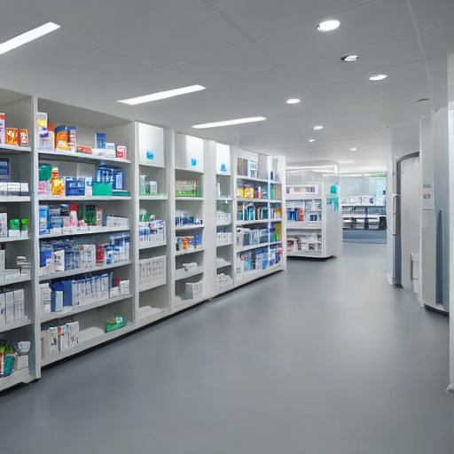
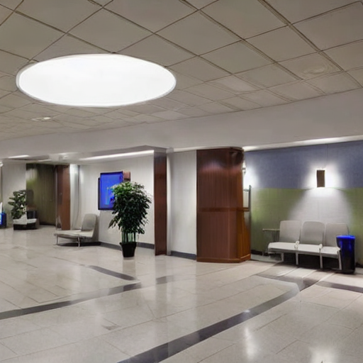

# PRODIGY_GA_02

## Healthcare Image Generation using Stable Diffusion

### Overview
This project demonstrates text-to-image generation using Stable Diffusion. The objective was to generate realistic healthcare-related images from natural language prompts.

The generated images focus on modern pharmacy infrastructure and automated medication dispensing environments, showcasing the capabilities of diffusion-based generative AI models.

---

## Project Objective

Generate high-quality healthcare-themed images from text prompts using Stable Diffusion.

---

## Prompts Used

### Prompt 1
A modern hospital pharmacy with organized medicine shelves, clean clinical environment, bright lighting, realistic healthcare infrastructure, professional medical facility, ultra realistic.

### Prompt 2
A contemporary hospital reception and waiting area with modern furnishings, bright lighting, clean healthcare infrastructure, realistic medical facility interior, ultra realistic.

---

## Technologies Used

- Python
- Google Colab
- Stable Diffusion
- Hugging Face Diffusers
- PyTorch

---

## Generated Outputs

• Modern Hospital Pharmacy
• Contemporary Hospital Reception
Both images were generated from natural language prompts using Stable Diffusion without manual editing.

## Generated Images

### Hospital Pharmacy

---

### Hospital Reception

---

## Repository Structure

PRODIGY_GA_02
│
├── generated_images/
│   ├── pharmacy_image_1.png
│   └── hospital_lobby_image_2.png
│
├── screenshots/
│
├── PRODIGY_GA_02_Stable_Diffusion.ipynb
├── requirements.txt
├── README.md
└── LICENSE

---

## Internship Information

Completed as part of the Generative AI Internship Program at Prodigy InfoTech.
