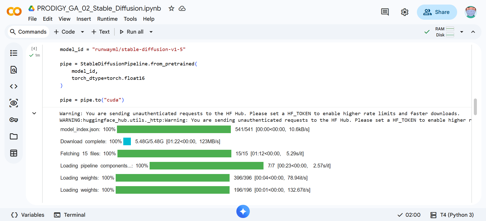
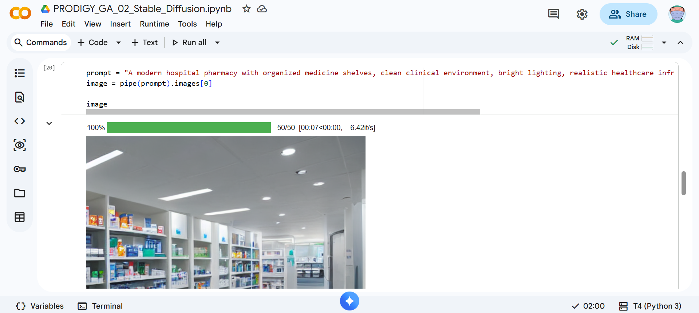
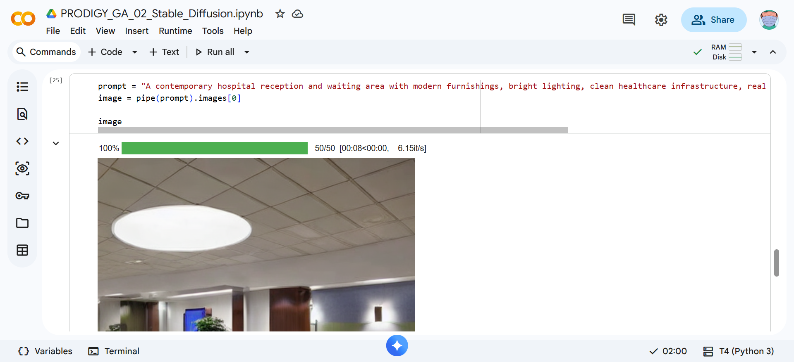

# PRODIGY_GA_02

## Task 02 - Generative AI Internship @ Prodigy InfoTech

## Healthcare Image Generation using Stable Diffusion

### Overview
This project demonstrates text-to-image generation using Stable Diffusion. The objective was to generate realistic healthcare-related images from natural language prompts.

The generated images depict realistic healthcare environments, including a modern hospital pharmacy and a contemporary hospital reception area, demonstrating the capabilities of Stable Diffusion for healthcare-themed image generation.

---

## Project Objective

Generate high-quality healthcare-themed images from text prompts using Stable Diffusion.

---

## Features

Text-to-image generation using Stable Diffusion
Healthcare-focused image creation
Natural language prompt-based generation
High-quality realistic image synthesis
Implemented in Google Colab

---

## Prompts Used

### Prompt 1
A modern hospital pharmacy with organized medicine shelves, clean clinical environment, bright lighting, realistic healthcare infrastructure, professional medical facility, ultra realistic.

### Prompt 2
A contemporary hospital reception and waiting area with modern furnishings, bright lighting, clean healthcare infrastructure, realistic medical facility interior, ultra realistic.

---

## Technologies Used

- Python
- Google Colab
- Stable Diffusion
- Hugging Face Diffusers
- PyTorch

---

## Model Details 

- Model: Stable Diffusion v1.5
- Framework: Hugging Face Diffusers
- Generation Method: Text-to-Image Synthesis

---

## Project Workflow
1. Installed Stable Diffusion dependencies.
2. Loaded the Stable Diffusion v1.5 model.
3. Created healthcare-focused text prompts.
4. Generated images using text-to-image synthesis.
5. Saved and visualized generated outputs.
6. Evaluated image quality and realism.

---

## Generated Outputs

- Modern Hospital Pharmacy
- Contemporary Hospital Reception

Both images were generated from natural language prompts using Stable Diffusion without manual editing.

---

## Results

- Successfully generated realistic healthcare-themed images from text prompts.
- Produced detailed hospital pharmacy and reception area scenes.
- Demonstrated the effectiveness of Stable Diffusion for healthcare-related image generation.
- Generated images without manual editing or post-processing.

---

## Screenshots

### Generation Process

### Pharmacy Output

### Hospital Lobby

---

## Generated Images

### Hospital Pharmacy

---

### Hospital Reception

---

## Repository Structure

PRODIGY_GA_02
│
├── generated_images/
│   ├── pharmacy_image_1.png
│   └── hospital_lobby_image_2.png
│
├── screenshots/
│
├── .gitignore
├── PRODIGY_GA_02_Stable_Diffusion.ipynb
├── requirements.txt
├── README.md
└── LICENSE

---
